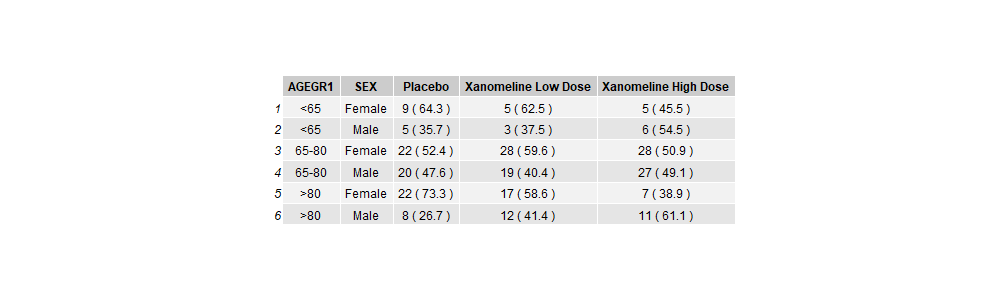

이 프로젝트에서는 다음과 같은 인구통계 요약표(Demography Summary Table) 생성을 목표로 합니다.



구조를 모방하여 R 코딩에 익숙해지고, 성별 및 치료군별 빈도와 백분율을 계산해 보겠습니다.

## 목표

- ADSL SAS (xpt) 데이터셋 읽기
- 유효성 분석 대상군(Efficacy Population) 서브셋 추출
- 그룹별 빈도(n) 산출 및 총 N 대비 백분율 계산
- 표 작성을 위한 데이터 전치(Transpose)

## 이 문서 사용법

이 문서에는 코드 청크와 설명 텍스트가 포함되어 있습니다. 지침에 따라 코드 청크를 수정하고 실행하며 출력을 확인해 보세요.

## 데이터 소스

이 프로젝트에서는 익명화된 CDISC 데이터셋을 사용합니다:
<https://github.com/phuse-org/phuse-scripts/tree/master/data/adam/cdisc>

## R 객체와 함수

R에서는 다양한 유형의 **객체**를 사용하며 **함수**를 적용합니다. 기본 구조는 `<함수_이름>(<인수1>=값, <인수2>=값)`입니다. RStudio IDE의 탭 완성 기능을 활용하면 인수를 쉽게 입력할 수 있습니다.

# 미니 프로젝트 시작

1. 먼저 필요한 패키지인 `tidyverse`와 `rio`를 로드합니다.

```{r setup}
library(tidyverse)
library(rio)
```

2. 데이터를 읽어와 `adsl` 객체에 저장합니다. `rio` 패키지의 `import()` 함수를 사용합니다.

```{r read_adsl_data}
adsl <- import(file = "./data/adsl.xpt")
head(adsl)
```

유효성 분석 대상군 추출을 위해 `EFFFL` 변수가 "Y"인 데이터만 필터링합니다.

> **간단 퀴즈**: 다음 중 변수 `EFFFL`의 값이 "Y"인 데이터를 필터링하는 올바른 옵션은 무엇입니까?
>
> - `filter(.data = adsl, EFFFL = Y)`
> - `filter(.data = adsl, EFFFL == "Y")`
> - `filter(.data = adsl, "EFFFL" == "Y")`
> - `filter(.data = adsl, EFFFL = "y")`

정답을 아래 코드 청크에 적용해 보세요.

```{r create_adsl_saf}
adsl_eff <- adsl %>%
  filter(EFFFL == "Y")
head(adsl_eff)
```

**팁**: 대소문자가 확실하지 않을 때는 `casefold(EFFFL, upper=TRUE) == "Y"`와 같이 처리하는 것이 안전합니다.

3. 주변 합계(Marginal Totals, N) 산출 - 각 치료군별 대상자 수 계산.

백분율 계산의 분모가 될 큰 N을 산출합니다. `group_by()`와 `count()`를 사용합니다.

> **SAS 사용자를 위한 팁**: `group_by()`는 SAS의 `BY` 문과 유사하게 작동합니다. 이후의 모든 작업은 그룹별로 수행됩니다.

```{r group_by}
adsl_eff %>%
  group_by(TRT01A) %>%
  count(name = "N")
```

정렬을 위해 `TRT01AN`(숫자)과 `TRT01A`(레이블)를 함께 그룹화하는 것이 유용합니다.

```{r big_N}
Big_N_cnt <- adsl_eff %>%
  group_by(TRT01AN, TRT01A) %>%
  count(name = "N")
head(Big_N_cnt)
```

4. 치료군 내 성별(`SEX`) 빈도(small n) 산출.

그룹화 변수에 `SEX`를 추가합니다.

```{r small_n}
small_n_cnt <- adsl_eff %>%
  group_by(TRT01AN, TRT01A, SEX) %>%
  count(name = "n")
head(small_n_cnt)
```

5. 백분율 계산을 위한 데이터 병합.

`left_join()`을 사용하여 빈도 데이터(`small_n_cnt`)와 합계 데이터(`Big_N_cnt`)를 결합합니다. SQL의 `JOIN`과 유사합니다.

```{r left_join}
adsl_mrg_cnt <- small_n_cnt %>%
  left_join(Big_N_cnt, by = c("TRT01A", "TRT01AN"))
head(adsl_mrg_cnt)
```

6. 백분율 산출.

`mutate()` 함수로 새로운 열 `perc`를 만듭니다.

```{r mutate}
adsl_mrg_cnt %>%
  mutate(perc = (n/N)*100)
```

7. 소수점 반올림.

`round()` 함수를 사용합니다. 

**주의**: R의 `round()`는 'Round to Even' 방식을 따르므로 SAS와 결과가 다를 수 있습니다. 정밀한 비교가 필요한 경우 주의하세요.

```{r mutate_and_round}
adsl_mrg_cnt %>%
  mutate(perc = round((n/N)*100, digits=1))
```

8. 수치 데이터 서식 지정.

표에 표시할 때 "20.0"과 같이 일관된 소수점 자릿수를 보여주기 위해 `format(nsmall=1)`을 사용합니다. 수치 데이터가 문자(character) 타입으로 변환됩니다.

```{r formatting}
adsl_mrg_cnt %>%
  mutate(perc = round((n/N)*100, digits=1)) %>%
  mutate(perc_char = format(perc, nsmall=1))
```

9. 빈도와 백분율 합치기.

`paste()` 또는 `paste0()`를 사용하여 "n (perc%)" 형식을 만듭니다.

```{r}
adsl_mrg_cnt %>%
  mutate(perc = round((n/N)*100, digits=1)) %>%
  mutate(perc_char = format(perc, nsmall=1)) %>%
  mutate(npct = paste(n, paste0("(", perc_char, ")")))
```

10. 성별 레이블 재코딩.

"M", "F"를 "Male", "Female"로 변경합니다. `recode()` 함수를 활용합니다.

```{r recode}
adsl_mrg_cnt %>%
  mutate(perc = round((n/N)*100, digits=1)) %>%
  mutate(perc_char = format(perc, nsmall=1)) %>%
  mutate(npct = paste(n, paste0("(", perc_char, ")"))) %>%
  mutate(SEX = recode(SEX, "M" = "Male", "F" = "Female"))
```

11. 그룹 해제.

이후 작업에 영향을 주지 않도록 `ungroup()`을 수행합니다.

```{r ungroup}
adsl_mrg_cnt %>%
  ungroup()
```

12. 파이프를 이용한 워크플로 통합.

위의 모든 과정을 하나의 파이프라인으로 연결합니다.

```{r pipeline}
adsl_mrg_cnt <- small_n_cnt %>%
  left_join(Big_N_cnt, by = c("TRT01A", "TRT01AN")) %>%
  mutate(perc = round(n/N*100, digits=1)) %>%
  mutate(perc_char = format(perc, nsmall=1)) %>%
  mutate(npct = paste(n, paste0("(", perc_char, ")"))) %>%
  mutate(SEX = recode(SEX, "M" = "Male", "F" = "Female")) %>%
  ungroup() %>%
  select(TRT01A, SEX, npct)

head(adsl_mrg_cnt)
```

13. 데이터 전치 (Wide Format).

표 형식에 맞게 `pivot_wider()`를 사용하여 데이터를 펼칩니다.

```{r pivot_wider}
adsl_mrg_cnt %>%
  pivot_wider(names_from = TRT01A, values_from = npct)
```

## 챌린지 1: 연령 그룹(AGEGRP) 추가

위 단계를 반복하되, 그룹화 변수에 `AGEGR1`을 추가하여 분석해 보세요.

## 챌린지 2: 이상반응 데이터(adae.xpt) 활용

`adae.xpt` 데이터를 읽어와 안전성 분석 대상군(SAFFL)에 대한 신체기관별 이상반응(AEBODSYS) 빈도와 백분율을 산출해 보세요.
